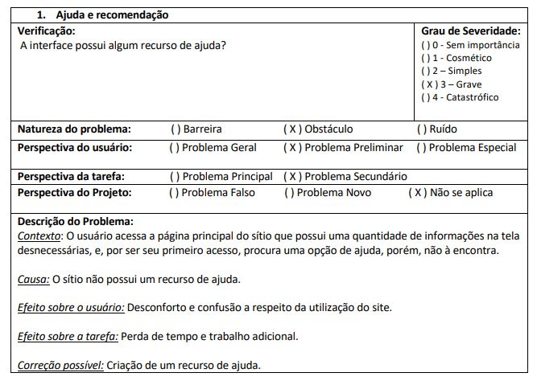
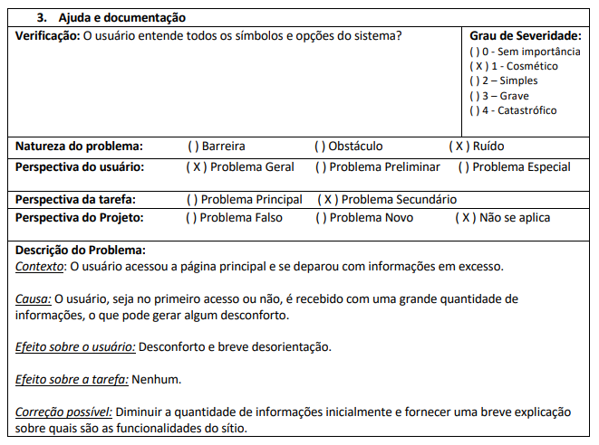
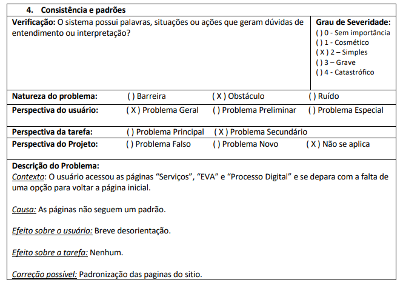
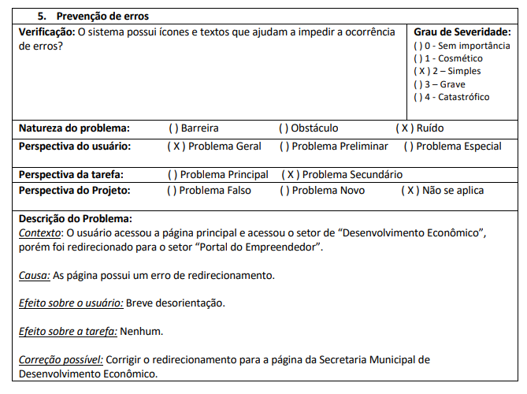

# Sites Avaliados

Inicialmente foram avaliados varios sites por cada integrante do grupo como mostrado na tabela a seguir.

| Site                                                                | Avaliador                       |
| ------------------------------------------------------------------- | ------------------------------- |
| [Prefeitura de Patos de Minas](http://patosdeminas.mg.gov.br/home/) | João Pedro Anacleto             |
| [CAE](https://sae.unb.br/cae/conteudo/unbfga)                       | Rodrigo Edmar Wright Dos Santos |
| [Na Hora](https://www.nahora.df.gov.br/)                            | Bruno Seiji Kishibe             |
| [Aprender](https://aprender3.unb.br/login/index.php)                | Augusto Campos Duarte           |
| [Gov](https://www.gov.br/pt-br)                                     | João Gabriel Elvas              |

### Prefeitura de Patos de Minas

O site da prefeitura de Patos de Minas contém dados relacionados aos processos seletivos, Portal do cidadão ,Serviços,Editais e Convocações e outros eventos relacionados a prefeitura de Patos de Minas (MG).Sendo possivel verificar todos esses dados alem de noticias e paginas relacionadas a historia de sua comunidade.

### CAE

Um site com o objetivo de agrupar diversos conteúdos de disciplinas diferentes. Podendo ser uma forma de estudo e revisão complementar para os alunos. Ele também possui informações importantes acerca da disciplina, como horários de monitoria e professores, sendo integrado com o sistema SAE.

### Na Hora

O site do na hora tem como principais funcionalidades: o autoatendimento e o agendamento de atendimento. Possui difícil navegação e organização ruim.

### Aprender 3

o Aprender 3 é uma nova versão do antigo moodle da UnB. A plataforma é uma sala de aula virtual onde o aluno tem a possibilidade de acompanhar as atividades do curso pela internet. O aluno terá acesso à plataforma com uso de um usuário e uma senha pessoal. O Aprender pode ser acessado em qualquer computador com internet. Ele é uma das principais plataforma de sustentação das atividades juntamente com o Sigaa. É através dele que o usuário poderá ter acesso ao conteúdos disponibilizados pelos professores, além de postar atividades, debater o tema em fóruns de discussão, tirar duvidas via mensagens, entre outros recursos

### Gov

O portal do gov tem como principal objetivo reunir em um só lugar, serviços para o cidadão e informações sobre a atuação do governo federal. Como por exemplo: consulta de CPF, Receber abono Salarial, consultar e solicitar a devolução de valores a receber, consultar a restituição do imposto de renda, obter a carteira de trabalho, emitir a certidão de regularidade fiscal e etc. Buscando assim facilitar tanto serviços como acesso a informações sobre o governo.

## Site escolhido - Prefeitura de Patos de Minas

O portal, da Prefeitura municipal de Patos de Minas, tem como objetivo ser o canal oficial de
comunicação com a população municipal. O portal da prefeitura, tem um papel importante no
dia a dia do município que é o de informar e tornar o acesso de todos os processos que
transitam no mesmo, licitações, leis, decretos, processos seletivos, concursos públicos, entre
tanto outros.

### Motivação

A escolha do site foi feita a partir de alguns critérios. Temos como exemplo a sua usabilidade, sua importância no dia a dia dos usuários, a sua apresentação visual além de sua fraca interação, devido a problemas a acessibilidade e usabilidade, com o usuário. Desse modo, por ser um site público, é de suma importância sua existência no cotidiano dos cidadãos, que têm dificuldades ao utilizá-lo, seja por causa da sua grande curva de aprendizado ou pelos déficits do sistema em si. Levando em conta seu quesito visual e também referente a sua comunicação com o próprio usuário, através dos recursos do sistema, é possível de se acreditar que o site está bem datado e que pode sim ser melhorado.

Tendo isso em vista os principais critérios de escolha do site foram:

1. Usabilidade;
2. Acessibilidade;
3. Importância no cotidiano dos usuários;
4. Apresentação visual datadas;
5. Difícil interação;

### Avaliação do site

O metodo de avaliação escolhido foi a heurística no qual consiste em uma técnica de inspeção de usabilidade executado por examinadores que seguem um conjunto de princípios de usabilidade, as heurísticas, e avaliam todos os elementos de interface com o usuário, com o objetivo de encontrar falhas de usabilidade. Os critérios para avaliação heurística são: Status do sistema, compatibilidade com o mundo real, controle do usuário e liberdade, consistência e padrões prevenção de erros, Reconhecimento ao invés de relembrança, Flexibilidade e eficiência no uso, Estéticas e design minimalista, ajuda aos usuários no reconhecimento e diagnostico de erros, ajuda e documentação.

# Historico de versão

| Versão | Data  | Descrição                                          | Autor                 | Revisor             |
| ------ | ----- | -------------------------------------------------- | --------------------- | ------------------- |
| 1.0    | 19/11 | Criação do template do Planejamento                | João Pedro Anacleto   | Bruno Seiji Kishibe |
| 1.0    | 20/11 | Adição de membros da equipe e dos sites avaliados  | João Pedro Anacleto   | Bruno Seiji Kishibe |
| 1.1    | 22/11 | Adicionando motivação do site escolhido            | João Gabriel Elvas    | João Pedro Anacleto |
| 1.2    | 04/12 | Adicionando figuras da avaliação heuristica        | Augusto Campos Duarte | Bruno Seiji Kishibe |
| 1.3    | 07/12 | Realizando melhorias - motivação do site escolhido | João Gabriel Elvas    | Rodrigo Wright      |
