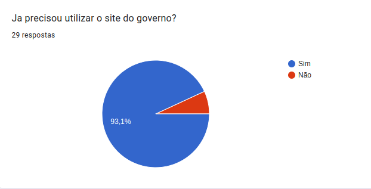
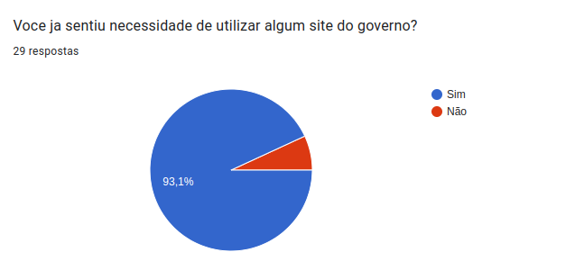

# Perfil do Usuário

## Introdução

A fim de aprender mais sobre o usuário e suas necessidades foi utilizado um formulário, com intuito de obter dados como seu grau de satisfação com sites do governo e de suas necessidades, como será apresentado a seguir.

## Metodologia

Para o levantamento de dados relativo ao perfil de usuario foi utilizado um formulario do google forms.Obitvemos em media 29 respostas no periodo de 5/12 a 7/12 no formulario a seguir: [Formulario](https://docs.google.com/forms/d/e/1FAIpQLSenSpFj_bBkKLr32BrTAirCS5a3Rz3_D7YYgUM0jT2sJtRd5A/viewform)

## Resultados

### 1 - Qual a sua faixa etária?

Para a obtenção de dados relacionados a faixa etária foi utilizado a seguinte pergunta do formulário na Figura 1.

Figura 1:faixa etária
 Fonte:Resultados adquiridos pelo formulário

### 2 - Você utiliza frequentemente a internet?

Para a obtenção de dados relacionados a Frequência de uso foi utilizado a seguinte pergunta do formulário na Figura 2.

Figura 2: Frequência de uso
 Fonte:Resultados adquiridos pelo formulário

### 3 - Já precisou utilizar o site do governo?

Para a obtenção de dados relacionados a Utilização do site foi utilizado a seguinte pergunta do formulário na Figura 3.

Figura 3: Utilização do site
 Fonte:Resultados adquiridos pelo formulário

### 4 - Já acessou o site da Prefeitura de Patos de Minas?

Para a obtenção de dados relacionados ao acesso ao site foi utilizado a seguinte pergunta do formulário na Figura 4.

Figura 4: Acesso ao site
 Fonte:Resultados adquiridos pelo formulário

### 5 - Você já sentiu necessidade de utilizar algum site do governo?

Para a obtenção de dados relacionados a necessidade de utilização foi utilizado a seguinte pergunta do formulário na Figura 5.

Figura 5: Necessidade de utilização
 Fonte:Resultados adquiridos pelo formulário

### 6 - Sentiu satisfeito com a interface do site?

Para a obtenção de dados relacionados à satisfação com a interface foi utilizado a seguinte pergunta do formulário na Figura 6.

Figura 6: Satisfação com a interface
 Fonte:Resultados adquiridos pelo formulário

### 7 - Acho que o site tem uma usabilidade intuitiva e simples?

Para a obtenção de dados relacionados a usabilidade do site foi utilizado a seguinte pergunta do formulário na Figura 7.

Figura 7: Usabilidade do site
 Fonte:Resultados adquiridos pelo formulário

### 8 - O que você recomendaria de mudança no site?

Para a obtenção de dados relacionados a recomendação do site foi utilizado a seguinte pergunta do formulário na Figura 8.

Figura 8: Recomendação do site
 Fonte:Resultados adquiridos pelo formulário

### 9 - Em uma escala de 1 a 5, o quanto você recomenda o site da prefeitura de Patos de Minas?

Para obtenção de dados relacionados a recomendação do site foi utilizado a seguinte pergunta do formulário na Figura 9.

Figura 9: Recomendação do site
 Fonte:Resultados adquiridos pelo formulário

### 10 - Considera que os sites do governo, em sua maioria, são mal feitos e não são totalmente ajustados para suprir todas as necessidades?

Para obtenção de dados relacionados ao Suprimento de necessidades foi utilizado a seguinte pergunta do formulário na Figura 10.

Figura 10: Suprir necessidades
 Fonte:Resultados adquiridos pelo formulário

## Conclusão

A partir da análise das respostas apresentadas anteriormente, conclui-se que em sua grande maioria os sites do governo, necessitam de atualizações e melhorias frequentes, dito que muitas vezes não possuem uma usabilidade nem uma acessibilidade desejada para um determinado tipo de usuário. Foram apresentadas também um grande acervo de sugestões de melhorias, fazendo entender, que o site peca em alguns aspectos mas não lhe tira sua identidade.

## Referência bibliográfica

> BARBOSA, Simone Diniz Junqueira; DA SILVA, Bruno Santana. Interação humano-computador. Elsevier, 2010.

## Histórico de versões

| Data       | Versão | Descrição                                                   | Autor(es)     |
| ---------- | ------ | ----------------------------------------------------------- | ------------- |
| 07/12/2022 | 1.0    | Criação do documento                                        | João Anacleto |
| 07/12/2022 | 1.1    | Criando e adicionando informações sobre o Perfil de Usuário | Matheus Salim |

