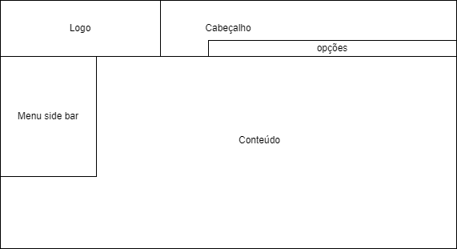
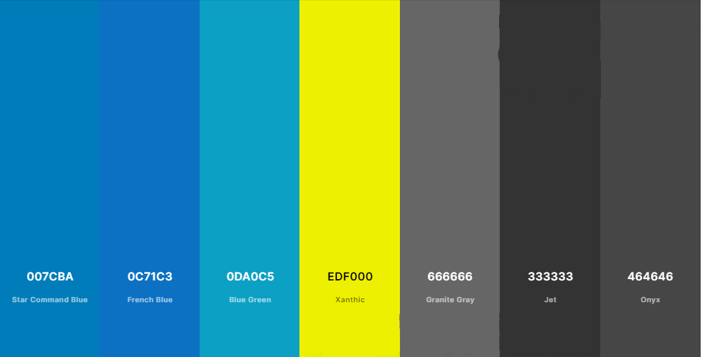
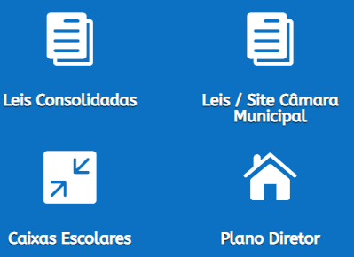
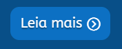

# Guia de Estilo

O guia de estilo é o documento que reúne os princípios e diretrizes adotados no projeto. Esse documento determinará os padrões que os designers deverão seguir na hora de implementar as telas. Isso permite que o projeto se mantenha alinhado com o que a esquipe de design projetou. Além disso, o guia de estilo deverá ser usado como uma ferramenta auxiliar de design, sendo ele não um conjunto de regras e sim um facilitador do trabalho e criatividade. Esta seção irá tratar exatamente desse documento, definindo os objetivos e elementos adotados pelo guia de estilo.

## 1. Objetivos

O objetivo deste guia de estilo é atender os padrões de design desenvolvidos para o projeto, e permitir que os usuários tenham a melhor interação possível com a plataforma. Nosso público alvo são jovens de 19 - 24 anos que usam site do governo (por necessidade ou não), interessados em receber informações úteis da prefeitura, como servidores públicos ou moradores de Patos de Minas. Além disso, por ser um site do governo, ele deve ser inclusivo e atender o público com deficiências que dificultem o uso de aplicações web.

## 2. Como usar

Em produção, este guia deverá ser usado como um molde para inserção de ideias, sempre sendo levado em consideração na hora de desenvolver o design da aplicação. Quando o projeto entrar na faze de manutenção, o guia servirá de auxílio para garantir que possíveis modificações não afetem na usabilidade do site.

## 3. Como manter

O guia de estilo deverá ser atualizado à medida que novas informações sobre o usuário forem chegando, porém deve se manter sempre alinhado com os princípios estabelecidos pelo o projeto. Além disso, quando alterações forem feitas, a equipe deverá verificar se as partes dos projetos já feitas (planejadas, desenvolvidas, etc.) estão de acordo com o novo estilo estabelecido.

# Identidade Visual do Site da Prefeitura de Patos de Minas

## 1. Elementos de interface

## 1.1. Layout

O layout é a disposição espacial dos elementos, que permite definir a posição geral de cada componente que comporá o site. Neste grid _imagem 1_ podemos ver como o site da prefeitura de patos de minas dispõem o seu site.

_(Imagem 1. Grid do site da Prefeitura de Patos de Minas, autoria própria)_

## 1.2. Cores

O esquema de cores é a palheta que é preferível usar no site, para que a aparência estética do site permaneça no padrão escolhido. No caso do site da prefeitura de Patos, podemos observar que as cores escolhidas fazem referência ao brasão do município, onde a cor predominante é azul. Porém temos outras cores que também compõem a palheta de cores _imagem 1_. Abaixo podemos observar a classificação de prioridade das cores utilizadas pelo site.

1.  Cores primárias: #007cba (azul), #0c71c3 (azul).
2.  Cor do fundo do site: #fff (branco).
3.  Cores secundárias: #0da0c5 (azul claro), #666 (cinza claro), #333 (cinza escuro), #edf000 (amarelo).

_(imagem 1, palheta de cores do site da prefeitura de Patos de Minas, autoria própria criada utilizando o coolors)._

## 1.3. Tipografia

O site utiliza a fonte **Helvetica** (_imagem 2_), que é uma fonte tipográfica sem serifa (sem os traços prolongados nas pontas das letras) gratuita desenvolvida por Max Miedinger e Eduard Hoffmann, ela também conhecida como Neue Haas Grotesk. Essa fonte é amplamente utilizada pelo mundo pela sua quantidade de variações e suporte a tipografia de diversos dialetos. Sendo assim, essa é uma fonte confiável que é mais do que capaz de atender o escopo do projeto.

Além do tipo de fonte, o padrão de tamanho de fonte usado no site é:

1. Título: **Sem predefinição**, sendo o tamanho ajustado para caber nos espaços fornecidos.
2. Nome te ícones e subtítulos: **16 ou 18 px** (a depender do tamanho do texto).
3. Textos no geral: **14 px**.

_(Imagem 2, fonte tipográfica Helvetica, fonte: https://commons.wikimedia.org/wiki/File:Helvetica_Neue_typeface_weights.svg)_

## 2. Elementos de Ação e interação

## 2.1. Ícones interativos e botões de ação

| Ícone                                                                                                                                                 | Descrição                                                                                                                                                                                                                                            |
| ----------------------------------------------------------------------------------------------------------------------------------------------------- | ---------------------------------------------------------------------------------------------------------------------------------------------------------------------------------------------------------------------------------------------------- |
|                           | **Brasão**: logo que pode variar dependendo da aba que o usuário está acessando.                                                                                                                                                                     |
|                                                                                   | **Setas Amarelas**: setas usadas para indicar as páginas de assuntos relevantes na página principal _home_.                                                                                                                                          |
|                                                                                       | **Pesquisa**: barra de pesquisa utilizada na página principal _home_, ela possui uma barra de texto do lado esquerdo e um botão de pesquisa do lado direito.                                                                                         |
|     | Ícones Rotulados: ícones que são rotulados com um subtítulo, o ícone varia dependendo da referência que ele faz e sua cor varia dependendo da cor de fundo alternando de branco (quando o fundo for azul) e cinza claro (quando o fundo for branco). |
|                                                                                        | **Filtrar**: botão para filtrar com base no que é escrito na caixa de texto ao lado, ele serve para filtrar o conteúdo de uma página                                                                                                                 |
|                                                                                       | **Imprimir**: botão usado para imprimir o documento que a página está mostrando.                                                                                                                                                                     |
|                                                                                       | **Leia mais**: botão usado para acessar o conteúdo que tem parte exposta na página principal _home_.                                                                                                                                                 |

## 3. Vocabulários e Padrões

1. Ler mais : utilizado como link que redireciona o usuário para outra aba com o conteúdo completo do que estava sendo visualizado.
2. Baixar: utilizado para referenciar uma ação de download de um documento.
3. Ver mais: utilizado para acessar mais opções de ações em determinada parte do site.

## 4. Referências Bibliográficas

> Barbosa, S. D. J.; Silva, B. S. da; Silveira, M. S.; Gasparini, I.; Darin, T.; Barbosa, G. D. J. (2021) Interação Humano-Computador e Experiência do usuário. Autopublicação.
>
> Site sobre Free fonts family que fala sobre a fonte Helvetica: https://freefontsfamily.com/helvetica-font-family/

## Histórico de Versões

| Data       | Versão | Descrição      | Autor          | Revisor      |
| ---------- | ------ | -------------- | -------------- | ------------ |
| 10/12/2022 | 1.0    | Guia de estilo | Rodrigo Wright | João Gabriel |
