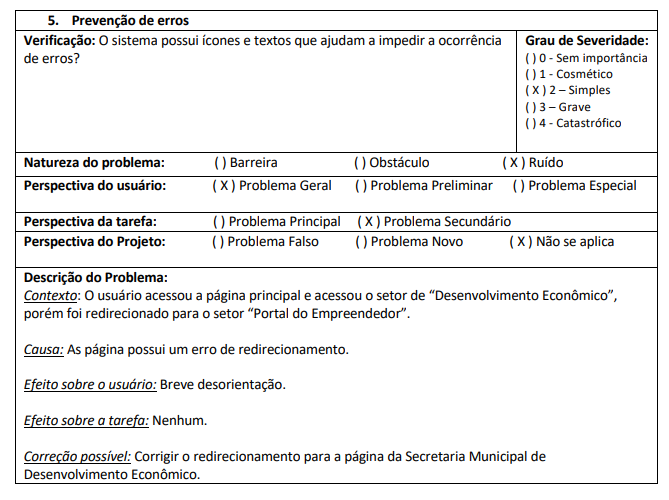

# Principios gerais de projeto

# Introdução

Princípios costumam representar objetivos gerais e de alto nível e Diretrizes apontam regras gerais comumente observadas na prática. Entretanto, essa classificação nem sempre é utilizada precisamente, e alguns proponentes de diretrizes as intitulam de princípios. Os conjuntos mais conhecidos de princípios e diretrizes são os de Norman (1988), de Tognazzini (2003), de Nielsen (1993) e as regras de ouro de Shneiderman (1998). Barbosa, G. D. J. (2021).

Os princípios e diretrizes utilizados em IHC se baseiam nos seguintes tópicos:

-Correspondência com as expectativas dos usuários.
-Simplicidade nas estruturas das tarefas.
-Equilíbrio entre controle e liberdade dos usuários.
-Consistência e padronização.
-Promoção da eficiência do usuário.
-Antecipação das necessidades do usuário.
-Visibilidade e reconhecimento.
-Conteúdo relevante e expressão adequada.
-Projeto para erros.

# Tópicos de Diretrizes e Princípios

## Correspondência com as expectativas dos usuários:

Explorar os mapeamentos naturais, seja entre as variáveis mentais e as físicas, seja entre as tarefas e os controles utilizados para manipular essas variáveis no mundo real e no sistema projetado.

## Simplicidade nas estruturas das tarefas:

Simplificar a estrutura de tarefas, reduzindo a quantidade de planejamento e resolução que elas requerem.

## Equilíbrio entre controle e liberdade dos usuários:

O usuário deve estar no controle; Eles não devem ficar presos num caminho de interação único para realizar uma atividade; Os usuários costumam querer sentir que controlam o sistema e o sistema responde às suas ações; O software deve ser maleável; Possibilidade de desfazer ações;

## Consistência e padronização:

Padronize as ações, os resultados das ações, o layout dos diálogos e as visualizações de informação.

## Promoção da eficiência do usuário:

Mantenha o usuário ocupado, ou seja, os processamentos demorados não devem impedir o usuário de realizar outras atividades no sistema, deixando os processos rodando em background.

## Antecipação das necessidades do usuário:

Tente prever o que o usuário quer e precisa, para fornecer todas as informações e ferramentas necessárias para cada passo do processo.

## Visibilidade e reconhecimento:

O designer deve tornar os objetivos visíveis; O estado do sistema, os objetos, as ações e as opções devem estar atualizados e facilmente perceptíveis; O usuário não deve ter de se lembrar de informações de uma parte da aplicação quando tiver passado para um outra parte da aplicação.

## Conteúdo relevante e expressão adequada:

Projeto estético e minimalista; Os rótulos de menus e botões devem ser claros e livres de ambiguidade; As mensagens de instruções e ajuda devem ser concisas e informativas sobre problemas que ocorrem.

## Projeto para erros:

Ajudar aos usuários a reconhecerem, diagnosticarem e se recuperarem de erros, informando-lhes sobre o que ocorreu, as consequências disso e como reverter os resultado indesejados.

# Conclusão

Conclui-se que, para o site da Prefeitura de Patos de Minas, vários princípios e diretrizes não foram aplicados. Por exemplo, consistência e padrões[1] e projeto para erros[2], apresentados nas figuras abaixo:

Figura 1 – Consistência e padrões[1].

Figura 2 – Prevenção de erros[2].

# Referência Bibliográfica

> Barbosa, S. D. J.; Silva, B. S. da; Silveira, M. S.; Gasparini, I.; Darin, T.; Barbosa, G. D. J. (2021) Interação HumanoComputador e Experiência do usuário. Autopublicação.

| Versão | Data     | Descrição             | Autor          | Revisor             |
| ------ | -------- | --------------------- | -------------- | ------------------- |
| 1.0    | 11/12/22 | Descrição de Personas | Augusto campos | João Pedro Anacleto |
