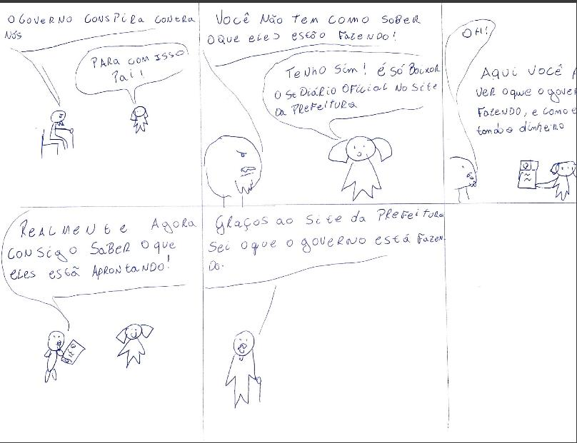

# Storyboard

O storyboard é uma representação gráfica das tarefas que o usuário fará, e principalmente como essas tarefas irão impactar na vida deste usuário. Dessa forma, para Scott Klemmer demos nos atentar principalmente a alguns aspectos do storyboard, como:

1. Pessoas envolvidas.
2. Ambiente.
3. Tarefa sendo realizada.
4. Necessidade do usuário.
5. O que o sistema é capaz de fazer.
6. Problema que o sistema soluciona para o usuário.

## Acessar notícias

Na figura (_Figura1_) abaixo temos o storyboard sobre a tarefa de acessar notícias.

_(Figura 1, tarefa acessar notícias, autor: Rodrigo Wright)_

## Acessar leis sobre covid-19

Na figura abaixo (_Figura2_) temos o storyboard sobre a tarefa de acessar leis sobre covid-19.

_(Figura 2, acessar leis sobre covid-19, autor: Rodrigo Wright)_

## Baixar diário oficial

Na figura abixo (_Figura3_) temos o storyboard sobre a tarefa de baixar o diário oficial.

_(Figura 3, baixar diário oficial, autor: Rodrigo Wright)_

## Requerir receita
Na figura abaixo (_Figura4_) temos o storyboard sobre a requisição da receita no portal de trasparência de Patos de Minas.

_(Figura 4, requerir receita, autor: Rodrigo Wright)_

## Referências Bibliográficas

> Vídeo no yotube do Scott Klemmer (https://www.youtube.com/watch?v=h2H3oIQtddU&ab_channel=Andr%C3%A9BarrosdeSales)

## Historico de versão

| Versão | Data  | Descrição                        | Autor          | Revisor       |
| ------ | ----- | -------------------------------- | -------------- | ------------- |
| 1.0    | 14/12 | Criação do documento com imagens | Rodrigo Wright | João Gabriel  |
| 1.1    | 11/01 | Adição do storyboard de receita  | Rodrigo Wright | João Gabriel  |
| 1.2    | 01/02 | Realizando ajustes nas imagens   | João Gabriel   |Rodrigo Wright |
