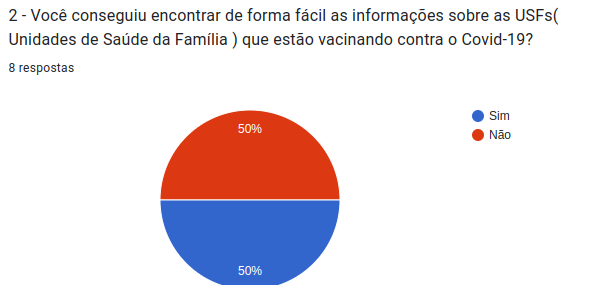
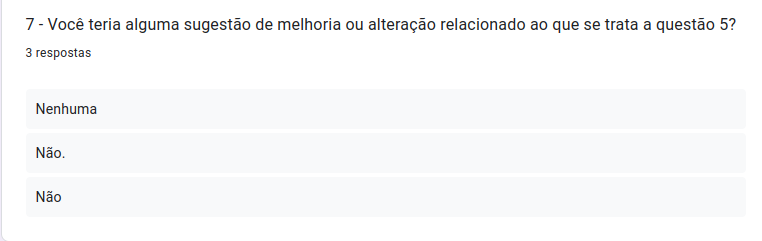
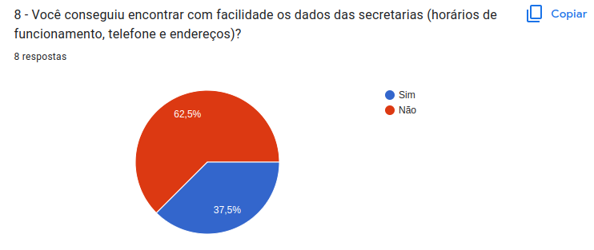

# Relato dos resultados da Analise de Tarefas

## Introdução

Estando de acordo com o planejamento da [Analise de Tarefas](https://interacao-humano-computador.github.io/2022.2-Prefeitura_Patos_de_Minas/Design_avaliacao_e_desenvolvimento/Analise_de_tarefas/planejamento_analise_de_tarefas/) o grupo utilizou como metodo de obtenção de dados o seguinte [Forms](https://docs.google.com/forms/d/e/1FAIpQLSc8klTfNuE3zROtAox8Jee0qvMqotgUA0TzA-noNA9fFTAznQ/viewform?usp=sf_link).

Lembrando que iremos utilizar os dados obtidos ate o momento para a nossa conclusão dos dados no qual pode estar sujeita a mudanças ao decorrer do projeto,tendo de ser notificada no cronograma geral do projeto.

Esse documento seguira o Framework DECIDE, focando na letra E, que significa de fato a avaliação (Evaluate).

## Objetivo

O objetivo desse documento tem como principal função documentar os dados obtidos da analise de tarefas e interpretar esses dados para a realização do projeto.

## Metodologia

A equipe decidiu utilizar o método de investigação (Inquiry) com a utilização de um [questionario](https://docs.google.com/forms/d/e/1FAIpQLSc8klTfNuE3zROtAox8Jee0qvMqotgUA0TzA-noNA9fFTAznQ/viewform?usp=sf_link) para fazer a avaliação,tendo o intuito de atingir um grupo de pessoas maior e por ser uma maneira mais prática para os participantes.
Para informações mais detalhadas sobre a utilização da metodologia bata conferir no [Planejamento](https://interacao-humano-computador.github.io/2022.2-Prefeitura_Patos_de_Minas/Design_avaliacao_e_desenvolvimento/Analise_de_tarefas/planejamento_analise_de_tarefas/).

## Participantes

Todos os participantes da avaliação são anonimos com o intuito de não expor ninguem.Alem de que para todos os dados obtidos os participantes concordaram com o termo de consentimento disponibilizado tanto na aba de [Questões eticas](https://interacao-humano-computador.github.io/2022.2-Prefeitura_Patos_de_Minas/Analise_de_Requisitos/questoes_eticas/) quanto no proprio questionarios

## Dados obtidos

<figcaption>

    Figura 1
</figcaption>

<figcaption>

    Figura 2
</figcaption>

<figcaption>

    Figura 3
</figcaption>

<figcaption>

    Figura 4
</figcaption>

<figcaption>

    Figura 5
</figcaption>

<figcaption>

    Figura 6
</figcaption>

<figcaption>

    Figura 7
</figcaption>

<figcaption>

    Figura 8
</figcaption>

<figcaption>

    Figura 9
</figcaption>

<figcaption>

    Figura 10
</figcaption>

<figcaption>

    Figura 11
</figcaption>

<figcaption>

    Figura 12
</figcaption>

<figcaption>

    Figura 13
</figcaption>

<figcaption>

    Figura 14
</figcaption>

<figcaption>

    Figura 15
</figcaption>

## Problemas encontrados

Identificamos que para encontrar as informações das USFs( Unidades de Saúde da Família ) esta sendo bem equilibrada uma vez que esta dividida em 50% possuindo um grau moderado de dificuldade para acessar as informações.Entretanto para encontrar dados sobre a secretaria como horarios de funcionamento,telefones e endereços se torna um processo mais dificl com um grau de dificuldade um pouco maior.

## Conclusão

Concluimos que os usuarios possuem uma dificuldade media e moderada para encontrar tanto informações das USFs( Unidades de Saúde da Família ) quanto das informações sobre a secretaria.Entretanto informações relativas ao diario oficial da cidade e suas noticias são de facil acesso sem uma grande dificuldade de serem acessadas logo nao sendo necessario uma mudança tão drastica.

## Bibliografia

> Barbosa, S. D. J.; Silva, B. S. da; Silveira, M. S.; Gasparini, I.; Darin, T.; Barbosa, G. D. J. Interação Humano-Computador e Experiência do usuário. Autopublicação. 2021

## Histórico de versões

| Versão | Data     | Descrição            | Autor               | Revisor      |
| ------ | -------- | -------------------- | ------------------- | ------------ |
| 1.0    | 20/12/22 | Criação do documento | João Pedro Anacleto | João Gabriel |
