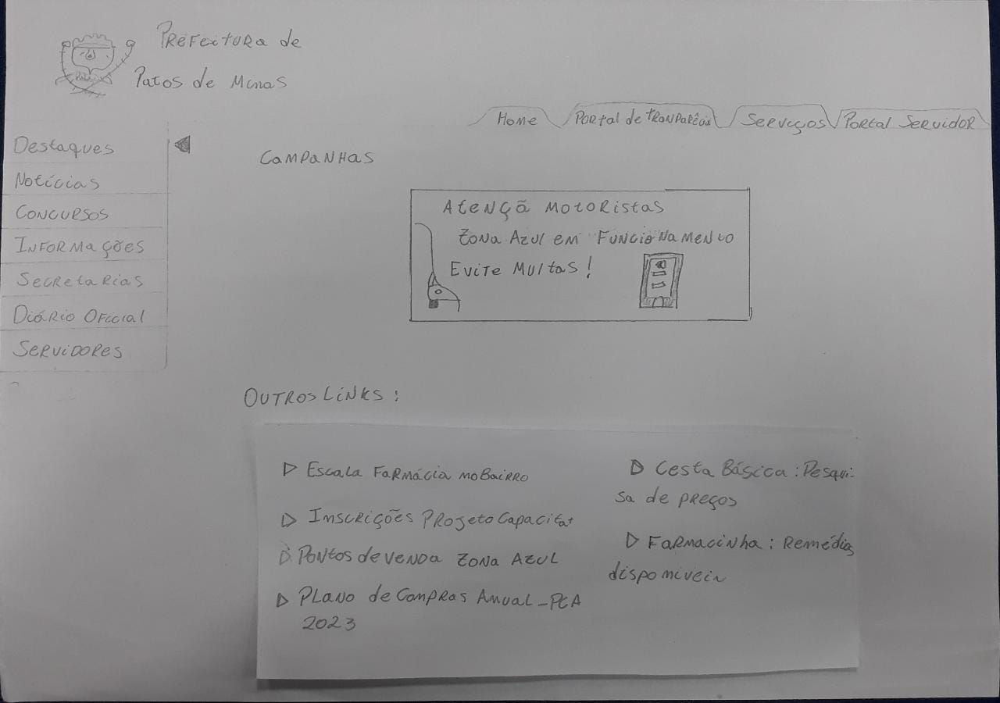
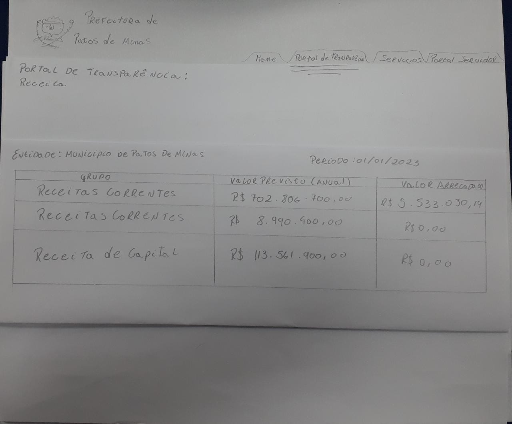

# Protótipo de Papel

## Introdução

Nesta seção apresentaremos o protótipo de papel desenvolvido para o site da Prefeitura de Patos de Minas. Esse protótipo será uma pequena idealização de como os desenvolvedores acham que o site deveria ser, e servirá de base para protótipos de maior fidelidade no futuro. Porém ele não focará nos detalhes gráficos, mas sim na usabilidade e disposição lógica do site priorizando a interação do usuário com a interface. 

## Metodologia

A metodologia utilizada para a prototipação é a de **protótipo de papel**. Nessa metodologia o desenvolvedor cria uma série de desenhos que simularão a aplicação, esses desenhos podem ser feitos em papel ou no computador e não precisam ser “bonitos” porque eles apenas representarão a funcionalidade em questão. Sendo assim, foram projetados alguns protótipos desenvolvidos com papel e caneta com base nessa metodologia.

## Protótipos de Papel

A sequência de imagens a seguir (_Figura 1 à 6)_ retratará as interfaces observadas pelo usuário a medida que ele for progredindo nas tarefas, tarefas essas ilustradas no storyboard do projeto:

_(Figura 1, página inicial home, autor: Rodrigo Wright)_

_(Figura 2, página de notícias, autor: Rodrigo Wright & João Gabriel)_

_(Figura 3, página do diário oficial, autor: Rodrigo Wright & João Gabriel)_

_(Figura 4, página inicial do portal de transparência, autor: Rodrigo Wright)_

_(Figura 5, página do formulário de requisição de receita, autor: Rodrigo Wright)_

_(Figura 6, página do resultado da requisição de receita, autor: Rodrigo Wright)_

## Historico de versão

| Versão | Data     | Descrição                        | Autor                         | Revisor |
| ------ | -------- | -------------------------------- | ----------------------------- | ------- |
| 1.0    | 11/01/23 | Criação do documento com imagens | Rodrigo Wright & João Gabriel |         |
